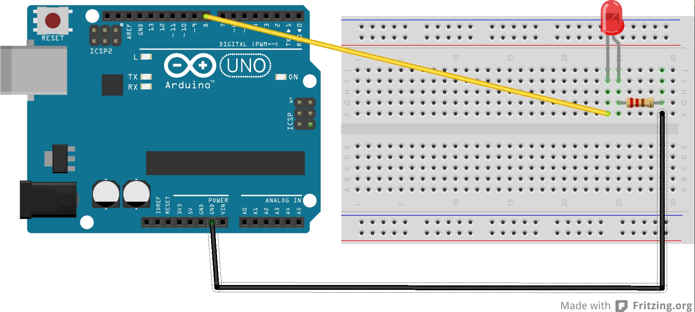

# Arduino + Javascript

Página web que controla um LED no arduino.


Esse projeto foi feito utilizando a plataforma [Johnny-Five](http://johnny-five.io/), que permite utilizar javascript para programar no arduino, além de suportar pacotes do [Node.js](https://nodejs.org/pt-br/), como o Express (que foi utilizado na parte web)

## Como rodar o projeto

### Requisitos:

- [Node.js](https://nodejs.org/pt-br/download/)
- npm ou [yarn](https://yarnpkg.com/getting-started/install) 
- [Placa Arduino](https://www.arduino.cc/) (UNO, MEGA, etc)
- Ter o johnny-five instalado e configurado ([clique aqui](https://github.com/rwaldron/johnny-five/wiki/Getting-Started))
- 1 LED
- 1 resistor
- Jumpers

Com tudo em mãos, basta montar o hardware e instalar o software

### Hardware

A montagem do arduino é simples, basta seguir a imagem abaixo



**Atenção!** A porta utilizada para ligar o LED deve ser a mesma do arquivo `index.js`, mas se usar outra porta basta modificar o arquivo no seguinte trecho:

```js
const led = new Led(11) // Aqui estou utilizando a porta 11
```

Com o hardware montado, ligue em uma porta USB do seu computador e vamos rodar o programa

### Software

- Clone o repositório e entre

    ```bash
    git clone https://github.com/GuilhermeBalog/arduino-javascript.git
    cd arduino-javascript
    ```

- Instale as dependências:

    ```bash
    npm install # ou
    yarn install
    ```

- Rode o servidor

    ```bash
    npm start # ou
    yarn start
    ```

O servidor estará rodando por padrão na porta 3000, então basta acessar [localhost:3000](http://localhost:3000/).

## Referências:

- **[Programando em JS com Node.js no Arduino](http://ramon-barros.com/arduino/2018/07/31/arduino-node-js.html)**, por Ramon Barros
- **[LED Examples](http://johnny-five.io/examples/led/)**, por Johnny-Five community
